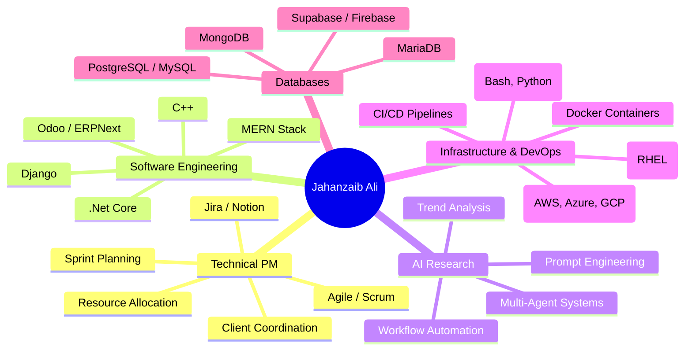
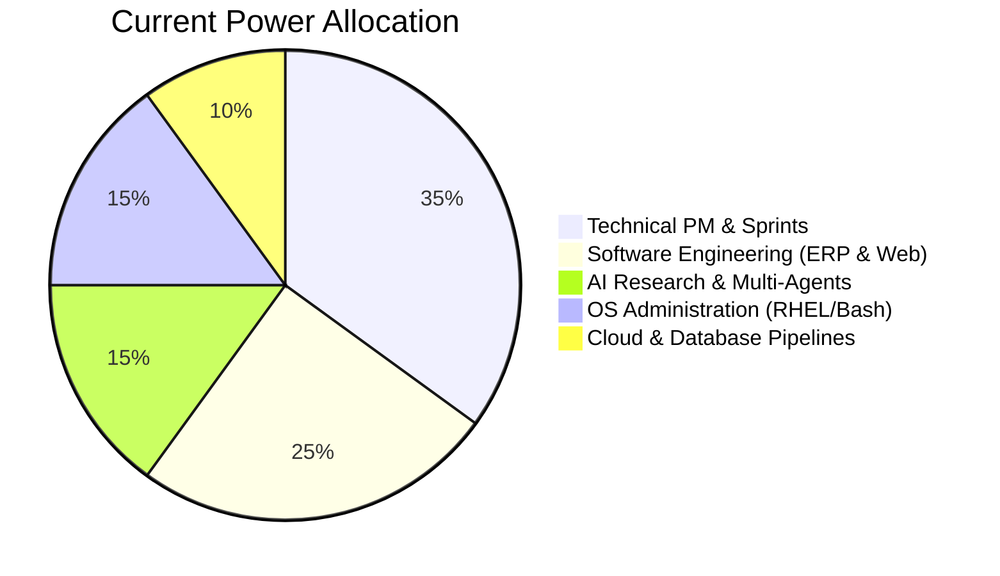

<div align="center">


<p align="center">
  <a href="mailto:jahanzaibalikhawaja26@gmail.com"></a>
  &nbsp;&nbsp;
  <a href="https://www.instagram.com/jahanzaib_ali2"></a>
  &nbsp;&nbsp;
  <a href="https://linkedin.com/in/jahanzaibali2"></a>
  &nbsp;&nbsp;
  <a href="https://github.com/Jahanzaibali2"></a>
  &nbsp;&nbsp;
  <a href="https://g.dev/jahanzaibali"></a>
</p>

</div>

---

<div align="center">

## 🐍 Contribution Snake

<picture>
  <source
    media="(prefers-color-scheme: dark)"
    srcset="https://raw.githubusercontent.com/Jahanzaibali2/Jahanzaibali2/output/github-contribution-grid-snake-dark.svg"
  />
  <source
    media="(prefers-color-scheme: light)"
    srcset="https://raw.githubusercontent.com/Jahanzaibali2/Jahanzaibali2/output/github-contribution-grid-snake.svg"
  />
  
</picture>

</div>


## 🎮 Character Sheet

<table>
<tr>
<td width="50%">

### ⚔️ Identity Loadout

| Attribute | Value |
|---|---|
| 🧑‍💻 **Player** | Jahanzaib Ali |
| 🏷️ **Class** | Technical Project Manager + Software Engineer |
| 🧙 **Subclass** | AI Research Analyst / Cloud Data Apprentice |
| ⚔️ **Weapons** | Python, JavaScript/MERN, Django, Linux/Bash, .Net |
| 🛡️ **Armor** | Git, CI/CD, RHEL Sec, Jira, Notion |
| 🧟 **Enemies** | Flaky Deployments, Scope Creep, 2 AM Prod Crashes |

</td>
<td width="50%">

### 🔥 Live Attributes

```text
JAHANZAIB.EXE initialized
HP:       ██████████ 100%
TPM/PM:   █████████░  90%
Eng:      ████████░░  80%
AI:       ████████░░  80%
RHEL/OS:  ████████░░  80%
Sleep:    ███░░░░░░░  30%
Grass:    ██░░░░░░░░  20%
```

</td>
</tr>
</table>

---

## 🧙‍♂️ About Me


Hey there, I'm **Jahanzaib Ali** — a hybrid **Technical Project Manager** and **Software Engineer** specializing in bridging the gap between deep technical execution and high-level product delivery. I drive initiatives across **Enterprise Linux (RHEL)**, **AI research / multi-agent architectures**, **ERP systems (Odoo, ERPNext)**, and **full-stack cloud engineering**.

Whether leading agile sprints, optimizing CI/CD, configuring workflows on Notion, or containerizing microservices, I make sure the product ships—securely, efficiently, and on schedule. 🚀

<br clear="right" />


<div align="center">

## 🧰 Inventory / Tech Stack


### 🗡️ Languages & Core


### ☁️ Cloud, Hosting & Runtime


### 🧩 Frameworks & Libraries


### 🏰 Databases, Web Servers & Design


### 🤖 Data Science, ML & Version Control


### 🛠️ DevOps, Tools & Platforms


### 🎮 Game Dev & Engines


### 📊 Project Management & Teamwork
<p align="center">
  <a href="https://www.atlassian.com/software/jira"></a>
  &nbsp;&nbsp;
  <a href="https://www.microsoft.com/microsoft-teams"></a>
  &nbsp;&nbsp;
  <a href="https://www.odoo.com"></a>
  &nbsp;&nbsp;
  
  &nbsp;&nbsp;
  
</p>

</div>


<div align="center">

## 📊 GitHub Battle Stats


<br/><br/>


<br/><br/>


<br/><br/>


<br/><br/>


</div>

---

## 🕹️ Role Selection Screen

| Archetype | Core Directive | Passive Ability | Ultimate Ability |
|---|---|---|---|
| 🛡️ **Technical Project Manager** | Lead engineering deliverables | Translates developer speak to clients | `Scope Shield / Sprint Sweep` |
| 💻 **Software Engineer** | Build full-stack solutions | Writes robust Odoo, MERN, & .Net modules | `Merge Request Execution` |
| 🤖 **AI Research Analyst** | Explore and apply AI trends | Connects multi-agent graphs to UI | `Autonomous Workflow Swarm` |
| ☁️ **Cloud Data Engineer** | Model cloud architectures | Spawns secure databases & pipelines | `High-Availability Partitioning` |
| 🐧 **RHEL System Engineer** | Manage OS in enterprise contexts | Audits banking configurations safely | `Chown Mastery / SELinux Grace` |

---

## 🧠 Skill Tree



---

## 📊 Brain Power Allocation



---

## 🧾 Quest Log

| Quest Name | Status |
|---|---|
| Deliver high-security RHEL banking projects | ✅ Completed |
| Architect multi-agent automation systems | ✅ Completed |
| Deploy customized Odoo & MERN systems | ✅ Completed |
| Complete Bachelors in Computer Science (BU) | 🟩 Active (Expected 2026) |
| Master Advanced Cloud Data Engineering Pipelines | 🟨 In Progress |
| Bridge gaps between developers, clients and timelines | ♾️ Eternal Quest |
| Answer "What is the update on this ticket?" | ⏱️ Constant Cooldown |
| Touch grass | ❌ Optional DLC |


## 🎮 Mini Game: PM / Dev Boss Fight

<details>
<summary>🟢 <b>Level 1: Client requests out-of-scope feature 48 hours before deployment.</b></summary>

```text
A) Say "yes" immediately and force devs to work overnight without warning.
B) Deny it flatly and tell the client to read the contract terms.
C) Log the change request in Jira, estimate effort, align with the dev lead, and present clear options/impacts to the client.
```

✅ Correct: **C**  
Reward: `+15 Client Diplomacy`, `+10 Team Trust`, `Scope Creep debuffed`
</details>

<details>
<summary>🟡 <b>Level 2: RHEL production database drops connection inside a high-security network.</b></summary>

```text
A) Run "rm -rf /" to restart the server filesystem.
B) Check systemctl service health, grep syslog for permission and memory flags, and review SELinux context.
C) Blame the database engine.
```

✅ Correct: **B**  
Reward: `+20 SysAdmin Sanity`, `Database restored`, `SELinux alignment achieved`
</details>

<details>
<summary>🔴 <b>Level 3: Multi-agent AI workflow gets trapped in an expensive recursive tool loop.</b></summary>

```text
Boss: RecursionWraith
HP: Infinite (Charging API billing card)
Weakness: strict token budgets & clear terminal boundaries
```

Move sequence: `Kill process → Set max_iterations = 5 → Inject system routing checks → Refine tool description parameters → Test locally`

🏆 Victory unlocked: **Budget Preserver**
</details>

---

## 🏆 Achievements Unlocked

| Achievement | Description |
|---|---|
| 🛡️ Agile Envoy | Successfully balanced client expectations and sprint metrics |
| 🐧 Sudo Sentinel | Configured system apps inside secure banking infrastructures |
| 🤖 Agent orchestrator | Modelled workflow automation charts for developer teams |
| 📦 ERP Integrationist | Successfully customized Odoo and Django architectures |
| 🪓 Pipeline Builder | Standardized Git flows and automated unit checks via CI/CD |
| ☕ Standup Summoner | Conducted project alignment syncs without exceeding 15 minutes |

---

<div align="center">

## 🧿 Developer Mood Board


</div>
